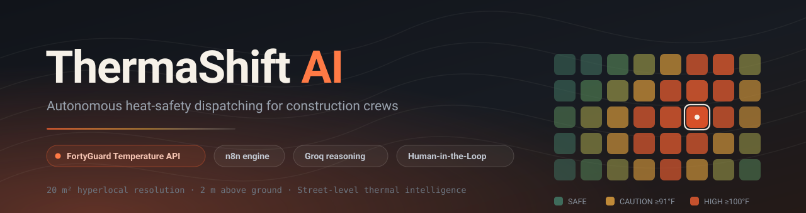
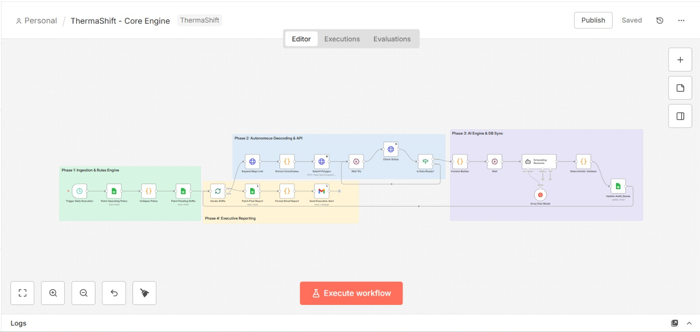
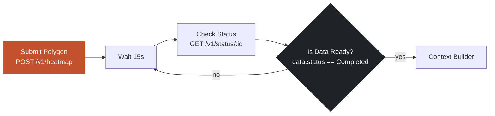

<div align="center">



# ThermaShift AI

**Autonomous heat-safety dispatching for construction crews.**

ThermaShift reads tomorrow's shift schedule from a Google Sheet, pulls the exact jobsite coordinates out of
a Google Maps link, requests **hyper-local thermal arrays from the FortyGuard Temperature API**, and has a
reasoning model decide whether each shift is safe — then writes the verdict back to the schedule and emails
an executive summary for a human manager to approve.

<br />

[](https://www.fortyguard.com/hackathon26)
[](https://www.fortyguard.com/hackathon26)
[](n8n-workflow/)
[](https://groq.com/)
[](#7-google-sheet-schema)
[](LICENSE)

[🎬 Watch the demo](#demo) · [🚀 Self-host the n8n workflow](#10-self-host-the-n8n-workflow) ·
[🌡️ FortyGuard API usage](#5-fortyguard-api-usage) · [🏆 Judging criteria map](#judging-criteria-map)

</div>

---

## 📑 Table of contents

| | |
|---|---|
| [🎬 Demo](#demo) | [🏆 Judging criteria map](#judging-criteria-map) |
| [1. The problem](#1-the-problem) | [2. The solution](#2-the-solution) |
| [3. How it works](#3-how-it-works) | [4. Architecture](#4-architecture) |
| [5. FortyGuard API usage](#5-fortyguard-api-usage) | [6. The decision engine](#6-the-decision-engine) |
| [7. Google Sheet schema](#7-google-sheet-schema) | [8. Repository structure](#8-repository-structure) |
| [9. Run the site locally](#9-run-the-site-locally) | [10. Self-host the n8n workflow](#10-self-host-the-n8n-workflow) |
| [11. Reliability & security](#11-reliability--security) | [12. Human-in-the-loop](#12-human-in-the-loop) |
| [13. Impact & business viability](#13-impact--business-viability) | [14. Known limitations](#14-known-limitations) |
| [15. Roadmap](#15-roadmap) | [16. Acknowledgements & license](#18-acknowledgements--license) |


---

<a id="demo"></a>

## 🎬 Demo

<!-- TODO: paste your final deployed URLs and video link before submitting. -->

| Artefact | Link |
|---|---|
| 🎥 **Video walkthrough (2–5 min)** | [https://www.loom.com/share/fcff253533f842fb93d3d4b329ad7dba](https://www.loom.com/share/fcff253533f842fb93d3d4b329ad7dba) |
| 🌐 **Landing page** | `https://tariq-bawany.github.io/therma-shift/` <!-- TODO: confirm after enabling GitHub Pages --> |
| 🎛️ **Demo console** | `https://tariq-bawany.github.io/therma-shift/demo.html` <!-- TODO: confirm after enabling GitHub Pages --> |
| 📊 **Live demo Google Sheet** | https://docs.google.com/spreadsheets/d/1fRMSlOQZbsYxlQh7mt7JIJv4-Mysr_SWPBtLGiEOkAQ/edit |
| ⚙️ **n8n workflow JSON** | [`n8n-workflow/ThermaShift - Core Engine.json`](n8n-workflow/ThermaShift%20-%20Core%20Engine.json) |

**The 120-second version of what to look for**

1. Open the **Google Sheet** — rows in `Audit_Queue` marked `Scheduled` are the inputs.
2. Open the **demo console** and enter your email → click **Run Autonomous Dispatch Audit**.
3. Wait for 2-3 mins, then refresh the **Google Sheet**:
   - Cool-site job (e.g., `TC-01`) typically remains **SAFE**
   - Extreme-heat job (e.g., `TC-02`) typically becomes **RESCHEDULED** with a proposed safer window written into `Agent Action`
   - Borderline cases may become **RESCHEDULED** or **HUMAN_INTERVENTION_REQUIRED** with a clear reason
4. Check your inbox — the executive summary email is the **manager approval** artifact (color-coded + rationale + mandates).
5. *Bonus (policy is data, not code):* In the **Google Sheet** tab `Operating_Policy`, change `Operating_Day_End` from `22:00` to `14:00`,
   re-run the audit, and verify proposals immediately respect the new operating bound.

---

<a id="judging-criteria-map"></a>

## 🏆 Judging criteria map

The official criteria are **Innovation · Technical Quality · Business Viability · Presentation**, with an
explicit requirement to document FortyGuard API usage [2](https://www.fortyguard.com/hackathon26). Here's
where each one is answered:

| Criterion | How ThermaShift answers it | Where to look |
|---|---|---|
| 🚀 **Innovation** | Not another heat *dashboard* — an **agentic dispatcher** that closes the loop: read schedule → locate jobsite → pull thermal data → reason → propose → write back → flag for human review (HUMAN_INTERVENTION_REQUIRED). **Partial-shift logic** is the non-obvious bit: instead of cancelling a day, it finds the longest safe productive block ("some work beats no work"). | [2 Solution](#2-the-solution) · [6 Decision engine](#6-the-decision-engine) |
| 🔧 **Technical Quality** — *incl. use of the FortyGuard API* | Correct use of the **async** FortyGuard contract: `POST /v1/heatmap` → `activity_id` → 15 s poll of `GET /v1/status/{id}`. Polygons are generated per jobsite (±0.005°), with the shift's own date, at `granularity: 60`. A **deterministic validator** means the LLM can't corrupt the schedule, and **sheet-driven policy** means rules are data, not code. | [5 FortyGuard API usage](#5-fortyguard-api-usage) · [6](#6-the-decision-engine) · [11 Reliability](#11-reliability--security) |
| 💼 **Business Viability** | Targets the sector with the **largest share of occupational heat deaths (36.8 %)**, where a federal heat standard is shifting employers to documented *pre-shift* planning. Zero retraining (dispatchers keep their spreadsheet), and the compliance artefact is a byproduct. | [1 Problem](#1-the-problem) · [13 Impact](#13-impact--business-viability) |
| 🎤 **Presentation** | One README, end to end: problem with citations → architecture diagrams → decision contract → **15-minute self-host guide** with a credential matrix, a URL/ID replacement table, and a troubleshooting table. Honest limitations + roadmap. | This file · [10 Self-host](#10-self-host-the-n8n-workflow) · [14–15](#14-known-limitations) |
| 🌡️ **FortyGuard API usage** *(required artefact)* | Both endpoints documented with request/response shapes, header-auth setup, the polling loop, and the °C → °F → risk-band transformation that turns 20 m² cells into a safety decision. | [5 FortyGuard API usage](#5-fortyguard-api-usage) |

**Track fit:** **Agentic AI** (autonomous reasoning + tool use + human escalation) · **Industrial &
Enterprise** (operational safety) · *adjacent:* Resilient Cities & Infrastructure.

---

## 1. The problem

Heat is the deadliest weather hazard on a jobsite, and **construction carries a wildly disproportionate share
of it**:

| Signal | Figure | Source |
|---|---|---|
| Construction's share of all US occupational heat deaths (2000–2010) | **36.8 %** — the largest of any sector | [PMC4657558](https://pmc.ncbi.nlm.nih.gov/articles/PMC4657558/) |
| Heat-related workplace deaths in construction, 2023 | **18 of 55 (32.7 %)** — while construction is ~7 % of the US workforce | [CPWR / S+H](https://www.safetyandhealthmagazine.com/27161-construction-workers-account-for-disproportionate-number-of-heat-related-deaths-cpwr/) |
| Average construction heat deaths per year, 2011–2023 | **14** | [CPWR / S+H](https://www.safetyandhealthmagazine.com/27161-construction-workers-account-for-disproportionate-number-of-heat-related-deaths-cpwr/) |
| Heat injuries/illnesses investigated by OSHA, 2017–2022 | **1,054** (625 hospitalizations, 211 fatalities) | [Federal Register, OSHA heat rule](https://www.federalregister.gov/documents/2024/08/30/2024-14824/heat-injury-and-illness-prevention-in-outdoor-and-indoor-work-settings) |
| Risk starts climbing | **Heat index > 80 °F** for strenuous work; ~75 % of fatalities fall in Jun–Aug | [NIOSH](https://www.cdc.gov/niosh/bulletin/2020/heat-stress-construction.html) |

**Why dispatchers still get it wrong.** A dispatcher planning tomorrow's pour looks up "Dubai" or "Phoenix"
and gets **one number for the whole city**. But FortyGuard's core insight — and the reason this API exists —
is that temperature varies dramatically *within* a city: at **20 m² resolution, measured 2 m above ground**,
a shaded jobsite and a black-asphalt roof four blocks away can differ by many degrees [2](https://www.fortyguard.com/hackathon26).
A city-level forecast is therefore the wrong instrument for a safety decision about *one specific jobsite*.

**The operational gap:** nobody re-reads the forecast at 4 a.m. and cross-checks it against 30 shifts,
each at a different address, while also respecting company operating hours and avoiding double-booking
crews. So it doesn't happen — or it happens by gut feel, with no audit trail.

<details>
<summary><b>Who feels the pain</b></summary>

- **Dispatcher / superintendent** — needs a defensible go/no-go per shift, before crews arrive.
- **Crew** — absorbs the actual risk; wants to be moved to a cooler window, not sent home unpaid.
- **HSE / compliance** — needs an auditable record that heat risk was assessed *before* the shift.
- **Owner / PM** — eats the cost of stoppages, injury claims, and OSHA exposure.

</details>

---

## 2. The solution

ThermaShift turns the jobsite schedule into an **autonomous, auditable heat-safety audit** that runs before
anyone clocks in.

| ❌ Dispatching today | ✅ ThermaShift AI |
|---|---|
| City-level forecast for a jobsite 30 km away | **20 m² hyper-local thermal arrays** pulled per jobsite from the FortyGuard Temperature API |
| Coordinates typed in by hand (or wrong) | **Coordinates extracted automatically** from the Google Maps link, including short `goo.gl`/`maps.app` links |
| Rules hardcoded in a spreadsheet nobody opens | **Business rules live in the sheet itself** (`Operating_Policy`) and are re-read every run |
| "It feels hot, let's start at 5 a.m." | **Reasoned decision** across heat risk, operating bounds, and calendar conflicts |
| Free-text LLM output you can't trust in production | **Deterministic validator** collapses every response into exactly three machine-readable states |
| Decisions live in someone’s head | **Every verdict written back** to the Google Sheet (Status + Agent Action) with a plain-language rationale + OSHA mandates for manager approval |
| Silence when the pipeline breaks | **Dedicated error workflow** that emails the crash, node, and execution ID |

### What makes it more than "an LLM wrapper"

1. **The model never holds the pen.** The LLM proposes; a deterministic validator decides. The model cannot
   invent a status, a time format, or a job that doesn't exist — a parse failure degrades to
   `HUMAN_INTERVENTION_REQUIRED`, never to a silently wrong schedule.
2. **Partial shifts, not just cancellations.** Real dispatchers don't want "cancel the day" — they want
   *"you can safely get 5 hours in before 11:00."* The reasoner is explicitly instructed to find the
   **longest safe partial block** when a full-duration window doesn't exist.
3. **Constraints are data, not code.** Change `Operating_Day_End` in the sheet from `22:00` to `14:00` and
   every subsequent proposal respects it — no redeploy.
4. **Human-in-the-loop is the default, not a disclaimer.** Nothing is silently applied; a manager approves.

---

## 3. How it works

Eight stages, one n8n workflow, zero manual data entry.

```mermaid
flowchart LR
    A["🗓️ Google Sheet<br/>Audit_Queue"] --> B["🔗 Expand Maps Link<br/>+ Extract Coordinates"]
    B --> C["🌡️ FortyGuard API<br/>POST /v1/heatmap"]
    C --> D["⏳ Async poll<br/>GET /v1/status/activity_id"]
    D --> E["🧠 Context Builder<br/>thermal timeline + policy + conflicts"]
    E --> F["🤖 Groq reasoner<br/>constrained JSON only"]
    F --> G["🛡️ Deterministic Validator<br/>3 legal states"]
    G --> H["📝 Write back to Google Sheet<br/>(Status + Agent Action)"]
    H --> I["📧 Executive summary email<br/>(manager approval)"]
    style C fill:#C4512D,stroke:#C4512D,color:#fff
    style G fill:#3F6B5B,stroke:#3F6B5B,color:#fff
```



| # | Stage | n8n node(s) | What happens |
|---|---|---|---|
| 01 | **Trigger** | `Trigger Daily Execution` *(Schedule)* · `Fetch Operating Policy` → `Collapse Policy` | On schedule, the engine first reads today's **business rules** from the `Operating_Policy` tab, then loads pending shifts. |
| 02 | **Ingestion** | `Fetch Pending Shifts` → `Iterate Shifts` | Pulls every row from `Audit_Queue` whose `Status` is `Scheduled`, then loops one shift at a time. |
| 03 | **Autonomous geocoding** | `Expand Maps Link` → `Extract Coordinates` | Requests the Maps URL with redirects **disabled** and scrapes the `location` header, so short links resolve too. A regex extracts lat/lon and **throws loudly** if it can't — no silent fallback coordinates. |
| 04 | **Thermal request** | `Submit Polygon` | Builds a ~1 km bounding polygon (±0.005°) around the jobsite and POSTs it to the **FortyGuard Temperature API** with the shift date and `granularity: 60`. Returns an `activity_id`. |
| 05 | **Async polling** | `Wait 15s` → `Check Status` → `Is Data Ready?` | FortyGuard processes asynchronously, so the engine polls `GET /v1/status/{activity_id}` every 15 s until `data.status === "Completed"`. |
| 06 | **Context building** | `Context Builder` | Converts FortyGuard's °C array to °F, builds an **hourly risk timeline**, computes the true shift duration, reads operating bounds from the sheet, and collects other jobs today for conflict avoidance. |
| 07 | **Reasoning + validation** | `Scheduling Reasoner` *(Groq `openai/gpt-oss-120b`)* → `Wait` → `Deterministic Validator` | The model gets a strict system prompt and must return JSON. The validator strips markdown fences, parses, and maps the decision to a legal status. |
| 08 | **Write-back + reporting** | `Update Audit_Queue` → *(loop)* → `Fetch Final Report` → `Format Email Report` → `Send Executive Alert` | Each verdict is written back matched on `Job ID`. When the loop drains, the whole queue is re-read and rendered into a single HTML executive summary email. |

---

## 4. Architecture

**Data flow in one line:**
`Sheets → Geo Extract → FortyGuard → Context → Groq → Validator → Sheets + Gmail`

**Design choices worth defending to a judge**

| Choice | Why it's the right call here |
|---|---|
| **Google Sheets as the database** | The customer *is* a dispatcher whose schedule already lives in a spreadsheet. Zero migration = zero adoption friction. The workflow is storage-agnostic: swap `Fetch Pending Shifts` for a Procore/Postgres node and nothing downstream changes. |
| **n8n as the runtime** | Every API call, retry, wait, and credential is visible and auditable — critical when the output is a safety decision. It also ships the whole product as **importable JSON**, so a judge can run it themselves in 15 minutes. |
| **Separate error workflow** | Operator-facing email and incident-handling are isolated. A Gmail outage can't silently swallow a crash alert. |
| **Two `Wait` nodes** | One polls FortyGuard (15 s); one paces requests into the LLM to stay inside rate limits. |

### The n8n canvas

<p align="center">
  
</p>

---

## 5. FortyGuard API usage

> This section documents exactly how the FortyGuard Temperature API is consumed — the endpoints, the
> request shape, the async polling contract, and the transformation into safety decisions.

### Endpoints consumed

| Method | Endpoint | Node | Purpose |
|---|---|---|---|
| `POST` | `https://api.fortyguard.com/v1/heatmap` | `Submit Polygon` | Submit an area-of-interest polygon + date; returns an `activity_id` |
| `GET` | `https://api.fortyguard.com/v1/status/{activity_id}` | `Check Status` | Poll the async job until `data.status === "Completed"` |

### Request: `POST /v1/heatmap`

The polygon is generated **per jobsite, per run** from the coordinates extracted out of the Google Maps link
(±0.005° ≈ a ~1 km box — tight enough to be genuinely local, wide enough to average out single-pixel noise):

```python

import requests
response = requests.post(
  "https://api.fortyguard.com/v1/heatmap",
  headers={"api-key": "your_api_key"},
  json={
    "polygon_aoi": {
      "type": "FeatureCollection",
      "features": [
        {
          "type": "Feature",
          "properties": {},
          "geometry": {
            "type": "Polygon",
            "coordinates": [
              [
                [-115.2126428, 36.1225564],
                [-115.2026428, 36.1225564],
                [-115.2026428, 36.112556399999995],
                [-115.2126428, 36.112556399999995],
                [-115.2126428, 36.1225564],
              ]
            ],
          },
        }
      ],
    },
      "date_time": {"start_date": "2026-08-29", "filter_type": 3},
      "granularity": 60,
  },
)
```
### Response: `POST /v1/heatmap`

```python
{
  "error": false,
  "status_code": 200,
  "message": "Heatmap Submitted Successfully",
  "data": {"activity_id": "f1a09add-6428-4b32-ab8b-e386aaa40d8b"},
}
```

- `start_date` is derived from the shift's own `Scheduled Start Time` — the engine always asks about
  **the day the work actually happens**, never "now".
- `granularity: 60` requests hourly resolution.


### Request: `GET v1/status/{activity_id}`
```python
import requests

# Replace {activity_id} with the actual activity ID from your submission
activity_id = "f1a09add-6428-4b32-ab8b-e386aaa40d8b"

response = requests.get(
    f'https://api.fortyguard.com/v1/status/{activity_id}',
    headers={'api-key': 'your_api_key'}
)
```
### Response: `GET v1/status/{activity_id}`
<details>
   <summary>check response</summary>
   
   ```python
     {
    "error": false,
    "status_code": 200,
    "message": "Completed",
    "data": {
      "activity_id": "f1a09add-6428-4b32-ab8b-e386aaa40d8b",
      "status": "Completed",
      "result": {
        "map_data": {
          "type": "FeatureCollection",
          "features": [
            {
              "id": "0",
              "type": "Feature",
              "properties": {
                "tile_id": 0,
                "average_temperature": 30.4566,
                "min_temperature": 27.5299,
                "max_temperature": 33.2302
              },
              "geometry": {
                "type": "Polygon",
                "coordinates": [
                  [
                    [
                      -115.20871588838266,
                      36.11455038934446
                    ],
                    [
                      -115.20805517162765,
                      36.11454050557275
                    ],
                    [
                      -115.20804310777147,
                      36.11507133612262
                    ],
                    [
                      -115.2087038289688,
                      36.11508122008547
                    ],
                    [
                      -115.20871588838266,
                      36.11455038934446
                    ]
                  ]
                ]
              }
            },
            {
              "id": "1",
              "type": "Feature",
              "properties": {
                "tile_id": 1,
                "average_temperature": 30.4568,
                "min_temperature": 27.5301,
                "max_temperature": 33.2297
              },
              "geometry": {
                "type": "Polygon",
                "coordinates": [
                  [
                    [
                      -115.20805517162765,
                      36.11454050557275
                    ],
                    [
                      -115.2073944551945,
                      36.11453061815958
                    ],
                    [
                      -115.20738238689601,
                      36.115061448518226
                    ],
                    [
                      -115.20804310777147,
                      36.11507133612262
                    ],
                    [
                      -115.20805517162765,
                      36.11454050557275
                    ]
                  ]
                ]
              }
            },
            {
              "id": "2",
              "type": "Feature",
              "properties": {
                "tile_id": 2,
                "average_temperature": 30.4569,
                "min_temperature": 27.5303,
                "max_temperature": 33.2291
              },
              "geometry": {
                "type": "Polygon",
                "coordinates": [
                  [
                    [
                      -115.2073944551945,
                      36.11453061815958
                    ],
                    [
                      -115.20673373908338,
                      36.11452072710495
                    ],
                    [
                      -115.20672166634256,
                      36.115051557272295
                    ],
                    [
                      -115.20738238689601,
                      36.115061448518226
                    ],
                    [
                      -115.2073944551945,
                      36.11453061815958
                    ]
                  ]
                ]
              }
            },
            {
              "id": "3",
              "type": "Feature",
              "properties": {
                "tile_id": 3,
                "average_temperature": 30.457,
                "min_temperature": 27.5305,
                "max_temperature": 33.2286
              },
              "geometry": {
                "type": "Polygon",
                "coordinates": [
                  [
                    [
                      -115.20673373908338,
                      36.11452072710495
                    ],
                    [
                      -115.20607302329431,
                      36.11451083240886
                    ],
                    [
                      -115.20606094611121,
                      36.11504166238486
                    ],
                    [
                      -115.20672166634256,
                      36.115051557272295
                    ],
                    [
                      -115.20673373908338,
                      36.11452072710495
                    ]
                  ]
                ]
              }
            },
            {
              "id": "4",
              "type": "Feature",
              "properties": {
                "tile_id": 4,
                "average_temperature": 30.4572,
                "min_temperature": 27.5306,
                "max_temperature": 33.2281
              },
              "geometry": {
                "type": "Polygon",
                "coordinates": [
                  [
                    [
                      -115.20607302329431,
                      36.11451083240886
                    ],
                    [
                      -115.20541230782747,
                      36.11450093407134
                    ],
                    [
                      -115.20540022620207,
                      36.115031763855896
                    ],
                    [
                      -115.20606094611121,
                      36.11504166238486
                    ],
                    [
                      -115.20607302329431,
                      36.11451083240886
                    ]
                  ]
                ]
              }
            },
            {
              "id": "5",
              "type": "Feature",
              "properties": {
                "tile_id": 5,
                "average_temperature": 30.4573,
                "min_temperature": 27.5308,
                "max_temperature": 33.2275
              },
              "geometry": {
                "type": "Polygon",
                "coordinates": [
                  [
                    [
                      -115.20541230782747,
                      36.11450093407134
                    ],
                    [
                      -115.20475159268297,
                      36.11449103209236
                    ],
                    [
                      -115.20473950661531,
                      36.11502186168543
                    ],
                    [
                      -115.20540022620207,
                      36.115031763855896
                    ],
                    [
                      -115.20541230782747,
                      36.11450093407134
                    ]
                  ]
                ]
              }
            },
            {
              "id": "6",
              "type": "Feature",
              "properties": {
                "tile_id": 6,
                "average_temperature": 30.4575,
                "min_temperature": 27.531,
                "max_temperature": 33.227
              },
              "geometry": {
                "type": "Polygon",
                "coordinates": [
                  [
                    [
                      -115.20475159268297,
                      36.11449103209236
                    ],
                    [
                      -115.20409087786092,
                      36.114481126471944
                    ],
                    [
                      -115.204078787351,
                      36.115011955873435
                    ],
                    [
                      -115.20473950661531,
                      36.11502186168543
                    ],
                    [
                      -115.20475159268297,
                      36.11449103209236
                    ]
                  ]
                ]
              }
            },
            {
              "id": "7",
              "type": "Feature",
              "properties": {
                "tile_id": 7,
                "average_temperature": 30.4576,
                "min_temperature": 27.5311,
                "max_temperature": 33.2265
              },
              "geometry": {
                "type": "Polygon",
                "coordinates": [
                  [
                    [
                      -115.20409087786092,
                      36.114481126471944
                    ],
                    [
                      -115.20343016336146,
                      36.1144712172101
                    ],
                    [
                      -115.20341806840926,
                      36.11500204641996
                    ],
                    [
                      -115.204078787351,
                      36.115011955873435
                    ],
                    [
                      -115.20409087786092,
                      36.114481126471944
                    ]
                  ]
                ]
              }
            },
            {
              "id": "8",
              "type": "Feature",
              "properties": {
                "tile_id": 8,
                "average_temperature": 30.4577,
                "min_temperature": 27.5313,
                "max_temperature": 33.2259
              },
              "geometry": {
                "type": "Polygon",
                "coordinates": [
                  [
                    [
                      -115.20343016336146,
                      36.1144712172101
                    ],
                    [
                      -115.20276944918469,
                      36.11446130430683
                    ],
                    [
                      -115.20275734979022,
                      36.11499213332497
                    ],
                    [
                      -115.20341806840926,
                      36.11500204641995
                    ],
                    [
                      -115.20343016336146,
                      36.1144712172101
                    ]
                  ]
                ]
              }
            },
            {
              "id": "9",
              "type": "Feature",
              "properties": {
                "tile_id": 9,
                "average_temperature": 30.4487,
                "min_temperature": 27.5202,
                "max_temperature": 33.2602
              },
              "geometry": {
                "type": "Polygon",
                "coordinates": [
                  [
                    [
                      -115.2087038289688,
                      36.11508122008547
                    ],
                    [
                      -115.20804310777147,
                      36.11507133612262
                    ],
                    [
                      -115.20803104359972,
                      36.11560216662186
                    ],
                    [
                      -115.2086917692395,
                      36.11561205077587
                    ],
                    [
                      -115.2087038289688,
                      36.11508122008547
                    ]
                  ]
                ]
              }
            },
            {
              "id": "10",
              "type": "Feature",
              "properties": {
                "tile_id": 10,
                "average_temperature": 30.4489,
                "min_temperature": 27.5204,
                "max_temperature": 33.2597
              },
              "geometry": {
                "type": "Polygon",
                "coordinates": [
                  [
                    [
                      -115.20804310777147,
                      36.11507133612262
                    ],
                    [
                      -115.20738238689601,
                      36.115061448518226
                    ],
                    [
                      -115.20737031828183,
                      36.11559227882625
                    ],
                    [
                      -115.20803104359972,
                      36.11560216662186
                    ],
                    [
                      -115.20804310777147,
                      36.11507133612262
                    ]
                  ]
                ]
              }
            },
            {
              "id": "11",
              "type": "Feature",
              "properties": {
                "tile_id": 11,
                "average_temperature": 30.449,
                "min_temperature": 27.5206,
                "max_temperature": 33.2591
              },
              "geometry": {
                "type": "Polygon",
                "coordinates": [
                  [
                    [
                      -115.20738238689601,
                      36.115061448518226
                    ],
                    [
                      -115.20672166634256,
                      36.115051557272295
                    ],
                    [
                      -115.20670959328596,
                      36.11558238738903
                    ],
                    [
                      -115.20737031828183,
                      36.11559227882625
                    ],
                    [
                      -115.20738238689601,
                      36.115061448518226
                    ]
                  ]
                ]
              }
            },
            {
              "id": "12",
              "type": "Feature",
              "properties": {
                "tile_id": 12,
                "average_temperature": 30.4492,
                "min_temperature": 27.5208,
                "max_temperature": 33.2585
              },
              "geometry": {
                "type": "Polygon",
                "coordinates": [
                  [
                    [
                      -115.20672166634256,
                      36.115051557272295
                    ],
                    [
                      -115.20606094611121,
                      36.11504166238486
                    ],
                    [
                      -115.20604886861219,
                      36.11557249231023
                    ],
                    [
                      -115.20670959328596,
                      36.11558238738903
                    ],
                    [
                      -115.20672166634256,
                      36.115051557272295
                    ]
                  ]
                ]
              }
            },
            {
              "id": "13",
              "type": "Feature",
              "properties": {
                "tile_id": 13,
                "average_temperature": 30.4493,
                "min_temperature": 27.521,
                "max_temperature": 33.2579
              },
              "geometry": {
                "type": "Polygon",
                "coordinates": [
                  [
                    [
                      -115.20606094611121,
                      36.11504166238486
                    ],
                    [
                      -115.20540022620207,
                      36.115031763855896
                    ],
                    [
                      -115.20538814426067,
                      36.115562593589836
                    ],
                    [
                      -115.20604886861219,
                      36.11557249231023
                    ],
                    [
                      -115.20606094611121,
                      36.11504166238486
                    ]
                  ]
                ]
              }
            },
            {
              "id": "14",
              "type": "Feature",
              "properties": {
                "tile_id": 14,
                "average_temperature": 30.4495,
                "min_temperature": 27.5212,
                "max_temperature": 33.2573
              },
              "geometry": {
                "type": "Polygon",
                "coordinates": [
                  [
                    [
                      -115.20540022620207,
                      36.115031763855896
                    ],
                    [
                      -115.20473950661531,
                      36.11502186168543
                    ],
                    [
                      -115.20472742023148,
                      36.11555269122785
                    ],
                    [
                      -115.20538814426067,
                      36.115562593589836
                    ],
                    [
                      -115.20540022620207,
                      36.115031763855896
                    ]
                  ]
                ]
              }
            },
            {
              "id": "15",
              "type": "Feature",
              "properties": {
                "tile_id": 15,
                "average_temperature": 30.4496,
                "min_temperature": 27.5214,
                "max_temperature": 33.2568
              },
              "geometry": {
                "type": "Polygon",
                "coordinates": [
                  [
                    [
                      -115.20473950661531,
                      36.11502186168543
                    ],
                    [
                      -115.204078787351,
                      36.115011955873435
                    ],
                    [
                      -115.20406669652476,
                      36.11554278522429
                    ],
                    [
                      -115.20472742023148,
                      36.11555269122785
                    ],
                    [
                      -115.20473950661531,
                      36.11502186168543
                    ]
                  ]
                ]
              }
            },
            {
              "id": "16",
              "type": "Feature",
              "properties": {
                "tile_id": 16,
                "average_temperature": 30.4498,
                "min_temperature": 27.5216,
                "max_temperature": 33.2562
              },
              "geometry": {
                "type": "Polygon",
                "coordinates": [
                  [
                    [
                      -115.204078787351,
                      36.115011955873435
                    ],
                    [
                      -115.20341806840926,
                      36.11500204641996
                    ],
                    [
                      -115.20340597314066,
                      36.11553287557916
                    ],
                    [
                      -115.20406669652476,
                      36.11554278522429
                    ],
                    [
                      -115.204078787351,
                      36.115011955873435
                    ]
                  ]
                ]
              }
            },
            {
              "id": "17",
              "type": "Feature",
              "properties": {
                "tile_id": 17,
                "average_temperature": 30.4499,
                "min_temperature": 27.5217,
                "max_temperature": 33.2556
              },
              "geometry": {
                "type": "Polygon",
                "coordinates": [
                  [
                    [
                      -115.20341806840926,
                      36.11500204641995
                    ],
                    [
                      -115.20275734979022,
                      36.11499213332497
                    ],
                    [
                      -115.20274525007925,
                      36.115522962292474
                    ],
                    [
                      -115.20340597314066,
                      36.11553287557916
                    ],
                    [
                      -115.20341806840926,
                      36.11500204641995
                    ]
                  ]
                ]
              }
            },
            {
              "id": "18",
              "type": "Feature",
              "properties": {
                "tile_id": 18,
                "average_temperature": 30.4402,
                "min_temperature": 27.5099,
                "max_temperature": 33.2924
              },
              "geometry": {
                "type": "Polygon",
                "coordinates": [
                  [
                    [
                      -115.2086917692395,
                      36.11561205077587
                    ],
                    [
                      -115.20803104359972,
                      36.11560216662187
                    ],
                    [
                      -115.20801897911237,
                      36.11613299707047
                    ],
                    [
                      -115.20867970919468,
                      36.116142881415634
                    ],
                    [
                      -115.2086917692395,
                      36.11561205077587
                    ]
                  ]
                ]
              }
            },
            {
              "id": "19",
              "type": "Feature",
              "properties": {
                "tile_id": 19,
                "average_temperature": 30.4404,
                "min_temperature": 27.5101,
                "max_temperature": 33.2918
              },
              "geometry": {
                "type": "Polygon",
                "coordinates": [
                  [
                    [
                      -115.20803104359972,
                      36.11560216662187
                    ],
                    [
                      -115.20737031828183,
                      36.11559227882625
                    ],
                    [
                      -115.20735824935194,
                      36.11612310908363
                    ],
                    [
                      -115.20801897911237,
                      36.11613299707047
                    ],
                    [
                      -115.20803104359972,
                      36.11560216662187
                    ]
                  ]
                ]
              }
            },
          ]}}}
    }
```
</details>

### Authentication

Sent as a **generic Header Auth** credential (never a hardcoded key):

| Header | Value |
|---|---|
| `api-key` | `{{ your FortyGuard API key }}` |
| `Content-Type` | `application/json` *(set automatically by n8n for JSON bodies)* |

### Async contract

FortyGuard returns a job handle rather than blocking, so the engine implements a proper poll loop
— no fixed `sleep and hope`:



### From temperature to a safety decision

The response is parsed in `Context Builder`:

```js
const features = $json.data.result.map_data.features || [];        // 20 m² cells
let totalTempC = 0;
features.forEach(f => { totalTempC += f.properties.average_temperature || 28; });
const avgTempF = Math.round(((features.length > 0 ? totalTempC / features.length : 28) * 9/5) + 32);
```

That hyper-local jobsite baseline is then expanded into an **hourly operating timeline** and labelled with
risk bands the reasoner is contractually bound to respect:

| Band | Threshold | Meaning for the reasoner |
|---|---|---|
| 🟢 `SAFE` | < 91 °F | Workable |
| 🟡 `CAUTION` | ≥ 91 °F | Workable, with mandated precautions |
| 🔴 `HIGH` | ≥ 100 °F | **Hard stop — a scheduled hour may never overlap this band** |

> **Where the value lands.** The city forecast says "38 °C". FortyGuard says *this* jobsite averages 43 °C
> at 14:00 because it's an unshaded asphalt roof. That delta is the difference between a safe shift and a
> heat-stroke call — and it is only visible at 20 m² resolution.

---

## 6. The decision engine

### The reasoning contract

`Scheduling Reasoner` runs on **Groq** (`openai/gpt-oss-120b`) with a system prompt that reads like a
safety spec, not a chatbot instruction. It receives four objects and must return *only* JSON:

```json
{
  "schedulingContext": {
    "current_job":            { "job_id": "TC-02", "location": "Roof Repair — Tower B",
                                "scheduled_start": "12:00", "duration_hours": 6 },
    "business_operating_bounds": { "earliest_start": "05:00", "latest_finish": "22:00" },
    "company_active_schedule": [ { "job_id": "TC-01", "location": "Midtown Pour",
                                   "start_time": "08:00", "end_time": "16:00" } ],
    "environmental_timeline": [ { "time": "12:00", "temp_f": 104, "risk_level": "HIGH" } ]
  }
}
```

**Rules enforced in the prompt**

1. **Heat safety** — no scheduled hour may overlap a `HIGH` (≥ 100 °F) band.
2. **Calendar deconfliction** — never double-book a location already in `company_active_schedule`.
3. **Operating bounds** — proposals must fit inside `business_operating_bounds`.
4. **Partial-shift logic** — prefer a full-duration block; if none exists, take the **longest safe partial
   block** ("some work beats no work"); if *zero* safe hours exist, escalate.
5. **OSHA mandates** — return concrete required controls, not vibes.

```json
{
  "decision": "SAFE | RESCHEDULE_FULL | RESCHEDULE_PARTIAL | HUMAN_INTERVENTION_REQUIRED",
  "new_start": "HH:MM or null",
  "new_end": "HH:MM or null",
  "reason": "Explain the safety factors, conflicts avoided, or why a partial shift was chosen.",
  "osha_mandates": ["Mandatory 15-minute rest breaks", "Minimum 1 quart of cool water per worker per hour"]
}
```

### The validator: why the LLM can't corrupt the schedule

`Deterministic Validator` is pure TypeScript-free JS with **no model access**. It strips ```json fences,
parses, and maps four model decisions into three durable states — and on *any* failure it fails safe:

| Model returns | Status written to the sheet | Guardrail |
|---|---|---|
| `SAFE` | `SAFE` | Approved as scheduled |
| `RESCHEDULE_FULL` | `RESCHEDULED` | Proposed window recorded |
| `RESCHEDULE_PARTIAL` | `RESCHEDULED` | Partial window + rationale recorded |
| `HUMAN_INTERVENTION_REQUIRED` | `HUMAN_INTERVENTION_REQUIRED` | Escalated for a human decision |
| *Unparseable / empty / any other value* | `HUMAN_INTERVENTION_REQUIRED` | **Fail-safe:** the raw error is written into the audit trail so nothing is silently dropped |

```js
// Deterministic Validator — excerpt
if (decision === "SAFE")            finalStatus = "SAFE";
else if (decision.includes("RESCHEDULE")) finalStatus = "RESCHEDULED";
else                                 finalStatus = "HUMAN_INTERVENTION_REQUIRED";
```

Every write is matched on `Job ID`, so re-running the audit is **idempotent** — it refreshes verdicts
instead of appending duplicates.

---

## 7. Google Sheet schema

The spreadsheet is the entire control plane: **inputs, business rules, and the audit trail all live in it.**

**Tab 1 — `Audit_Queue`** (gid `0`)

| Column | Required | Example | Notes |
|---|---|---|---|
| `Job ID` | ✅ | `TC-02` | Primary key — used to match the write-back |
| `Location Name` | ✅ | `Roof Repair — Tower B` | Used for conflict detection and reporting |
| `Google Maps Link` | ✅ | `https://maps.app.goo.gl/...` | Any Maps URL; short links are expanded automatically |
| `Latitude` / `Longitude` | ➖ | *(auto)* | Present for human reference; the engine derives coordinates from the link, so **they're never typed by hand** |
| `Scheduled Start Time` | ✅ | `2026-08-31T12:00` | `YYYY-MM-DDTHH:MM` |
| `Scheduled End Time` | ✅ | `2026-08-31T18:00` | `YYYY-MM-DDTHH:MM` |
| `Task Type` | ➖ | `Roofing` | Context for the reasoner |
| `Status` | ✅ | `Scheduled` | The engine only processes rows where `Status = Scheduled` |
| `Agent Action` | ➖ | *(written by the engine)* | Full rationale + OSHA mandates |

> ⚠️ **Set the two time columns to Plain text** (*Format → Number → Plain text*) and type times as
> `2026-08-31T12:00`. If Sheets parses them as dates, n8n returns a locale-formatted string and the
> engine's `split('T')` parsing breaks.

**Tab 2 — `Operating_Policy`** (gid `266971962`) — sheet-driven business rules, re-read on every run:

| Policy Name | Value |
|---|---|
| `Operating_Day_Start` | `05:00` |
| `Operating_Day_End` | `22:00` |

**Starter rows to reproduce the demo**

| Job ID | Location Name | Scheduled Start | Scheduled End | Status |
|---|---|---|---|---|
| `TC-01` | Midtown Pour | `2026-08-31T08:00` | `2026-08-31T16:00` | `Scheduled` |
| `TC-02` | Roof Repair — Tower B | `2026-08-31T12:00` | `2026-08-31T18:00` | `Scheduled` |
| `TC-03` | Road Work — Al Wasl | `2026-08-31T10:00` | `2026-08-31T14:00` | `Scheduled` |

---

## 8. Repository structure

```text
therma-shift/
├── assets/
│   ├── banner.svg                        # README hero
│   └── n8n-workflow.jpeg                 # workflow canvas screenshot
├── n8n-workflow/
│   ├── ThermaShift - Core Engine.json    # ⭐ the product: full automation, 21 nodes
│   └── ThermaShift - Error Handler.json  # ⭐ crash-isolation workflow (Error Trigger)
├── index.html                            # landing page
├── demo.html                             # demo console (run an audit, verify results)
├── config.js                             # ⚙️ endpoints for the static site
├── app.js                                # landing page behaviour (scroll + reveal)
├── demo.js                               # demo console behaviour
└── README.md
```

---

## 9. Run the site locally

The site is **static** — no build step, no dependencies, no bundler.

```bash
git clone https://github.com/tariq-bawany/therma-shift.git
cd therma-shift
python3 -m http.server 8080
# → http://localhost:8080            landing page
# → http://localhost:8080/demo.html  demo console
```

<details>
<summary><b>Other ways to serve it</b></summary>

```bash
npx serve .            # Node
php -S localhost:8080  # PHP
```
You can also open `index.html` directly in a browser — everything runs from the filesystem except the two
buttons that call the hosted trigger endpoint.

**Deploy:** push to `main`, then *Settings → Pages → Deploy from branch → `main` / root*.

</details>

### `config.js`

```js
window.THERMA_CONFIG = {
  n8nWebhookUrl:  "https://your-worker-or-n8n-webhook.example.com", // triggers an audit run
  googleSheetUrl: "https://docs.google.com/spreadsheets/d/<YOUR_SHEET_ID>/edit",
  workerAuditUrl: "https://your-worker-or-n8n-webhook.example.com"
};
```

| Key | What it does |
|---|---|
| `googleSheetUrl` | Target of the **Open Google Sheet** button — point it at your own copy |
| `n8nWebhookUrl` / `workerAuditUrl` | Endpoint the **Run Autonomous Dispatch Audit** button calls to kick off a run |

> **Note for reviewers:** the landing pages are supporting material. **The product is the n8n workflow in
> [`n8n-workflow/`](n8n-workflow/)** — import it, add your credentials, and it runs on any n8n instance
> without this site. To make the demo console trigger *your* instance, add a **Webhook** node (or use the
> production URL of a schedule-triggered run) and paste that URL into `config.js`.

---

## 10. Self-host the n8n workflow

Run the entire engine on your own n8n instance in ~15 minutes.

### Prerequisites

| Need | Detail |
|---|---|
| **n8n** | Any modern n8n Cloud or self-hosted instance (v1.8x+). Node versions in the JSON: Google Sheets `4.7`, HTTP Request `4.3`, LangChain Agent `3.1`, Gmail `2.2`, Code `2`. n8n auto-upgrades node versions on import. |
| **FortyGuard API key** | Free access + trial credits via the [hackathon](https://www.fortyguard.com/hackathon26) or [API plans](https://www.fortyguard.com/api-pricing) |
| **Groq API key** | Free tier at [console.groq.com](https://console.groq.com/keys) |
| **Google Cloud project** | With the **Google Sheets API** *and* **Gmail API** enabled |
| **Google Sheet** | Two tabs, per [7](#7-google-sheet-schema) |

---

### Step 1 — Create the credentials (4)

n8n stores credentials **outside** the workflow JSON, so an import gives you the *slots*, not the keys.
Create these four in **Credentials → Add credential**:

| # | Credential type | Suggested name | What to enter |
|---|---|---|---|
| 1 | **Header Auth** | `Fortyguard Header Auth` | **Name:** `api-key` · **Value:** your FortyGuard API key |
| 2 | **Groq API** | `Groq API` | Paste your `gsk_...` key |
| 3 | **Google Sheets OAuth2** | `ThermaShift Google Sheets account` | Google OAuth client (see below) |
| 4 | **Gmail OAuth2** | `ThermaShift Gmail account` | Same Google OAuth client; Gmail send scope |

<details>
<summary><b>Google OAuth setup — exact steps</b></summary>

1. Go to [console.cloud.google.com](https://console.cloud.google.com/) → create/select a project.
2. **APIs & Services → Library** → enable **Google Sheets API** and **Gmail API**.
3. **OAuth consent screen** → External → add your email as a **Test user** (otherwise Google blocks the
   consent flow while the app is unverified).
4. **Credentials → Create credentials → OAuth client ID** → Application type **Web application**.
5. Under **Authorized redirect URIs**, paste the **OAuth Redirect URL** that n8n shows inside the credential
   dialog. It is typically:
   - n8n Cloud → `https://<your-instance>.app.n8n.cloud/rest/oauth2-credential/callback`
   - local/self-hosted → `http://localhost:5678/rest/oauth2-credential/callback`
6. Copy the **Client ID** and **Client Secret** into the n8n credential and click **Sign in with Google**.

**Scopes used:** `https://www.googleapis.com/auth/spreadsheets` and
`https://www.googleapis.com/auth/gmail.send`.

> 💡 Copy the redirect URI from n8n rather than from this README — it varies by instance.

</details>

---

### Step 2 — Import the workflows

1. **Workflows → Add workflow → ⋯ → Import from File**
2. Import **`ThermaShift - Core Engine.json`** (21 nodes)
3. Import **`ThermaShift - Error Handler.json`** (2 nodes) into a *separate* workflow
4. Open each node flagged with a red ⚠️ and select the credential you created in Step 1

| Node | Credential to attach |
|---|---|
| `Fetch Pending Shifts`, `Fetch Operating Policy`, `Update Audit_Queue`, `Fetch Final Report` | `ThermaShift Google Sheets account` |
| `Submit Polygon`, `Check Status` | `Fortyguard Header Auth` |
| `Groq Chat Model` | `Groq API` |
| `Send Executive Alert`, `Dispatch Crash Alert` | `ThermaShift Gmail account` |

---

### Step 3 — Configure IDs, URLs and recipients

Replace these hardcoded values with your own. **This is the whole "point it at my accounts" step.**

| Node | Field | Ships as | Change to |
|---|---|---|---|
| 4 Sheets nodes | **Document ID** | `1fRMSlOQZbsYxlQh7mt7JIJv4-Mysr_SWPBtLGiEOkAQ` | Your sheet's ID (from its URL). *Easiest: open the dropdown and pick your sheet.* |
| 4 Sheets nodes | **Sheet** | `Audit_Queue` / `Operating_Policy` | Re-select the tab — `gid` values differ per sheet |
| `Send Executive Alert` | **Send To** | `shahrukhkknmd@gmail.com` | The dispatcher's inbox |
| `Dispatch Crash Alert` | **Send To** | `shahrukhkknmd@gmail.com` | Your ops/engineering inbox |
| `Submit Polygon` | **URL** | `https://api.fortyguard.com/v1/heatmap` | Keep, unless you're proxying FortyGuard |
| `Check Status` | **URL** | `https://api.fortyguard.com/v1/status/{{ ...activity_id }}` | Keep — the expression is already wired |
| `Groq Chat Model` | **Model** | `openai/gpt-oss-120b` | Any Groq model you have access to |

Then set the schedule and pacing:

| Node | Setting | Recommended |
|---|---|---|
| `Trigger Daily Execution` | ⚠️ **Ships empty — nothing runs until you set it** | Daily at **05:00** local, *before* the shift day starts |
| `Wait 15s` | Poll interval for FortyGuard | `15` s (raise to `30` if you hit rate limits) |
| `Wait` | Pacing before the LLM call | `1` s+ (raise for large queues with a metered Groq key) |
| `Is Data Ready?` | Condition | `{{ $json.data.status }}` **equals** `Completed` |

---

### Step 4 — Wire the error workflow ⚠️

**This does not survive import** — the exported JSON references the original workflow's internal ID
(`settings.errorWorkflow`), which won't exist on your instance.

1. Open the **Error Handler** workflow → copy its **workflow ID** from the URL (`/workflow/<ID>`).
2. Open **Core Engine → ⋯ (three dots) → Settings**.
3. Set **Error Workflow** → select `ThermaShift - Error Handler`.
4. **Save**, then toggle the Error Handler workflow to **Active**.

Verify it: temporarily break a node (e.g. an invalid sheet ID) and run — you should receive
**🚨 CRITICAL FAILURE: ThermaShift Engine Halted** naming the failing node and execution ID.

---

### Step 5 — Test, then activate

1. Click **Execute Workflow** (bottom-centre) — do *not* activate first.
2. Watch the canvas light up. Per shift: `Expand Maps Link` → `Submit Polygon` → poll loop → `Context Builder`
   → `Scheduling Reasoner` → `Deterministic Validator` → `Update Audit_Queue`.
3. Confirm the `Status` and `Agent Action` columns updated on **all** `Scheduled` rows.
4. Confirm the executive summary email arrived.
5. Toggle **Active** in the top-right. 🎉

---

### Troubleshooting

| Symptom | Cause | Fix |
|---|---|---|
| `Could not automatically extract coordinates...` | Maps link has no `@...` or `?q=` lat/lon | Use a link copied from the pin's actual location, or paste a URL containing `@lat,lon` |
| Runs hang on `Check Status` forever | `activity_id` invalid, API key rejected, or status string mismatch | Inspect the `Check Status` output; confirm the `api-key` header credential is attached |
| `Fetch Pending Shifts` returns nothing | No row has `Status` exactly `Scheduled` | Check casing/whitespace — the filter is a strict string match |
| Times parse as `08:00` defaults | Time columns are Date-typed, not text | Set **Format → Number → Plain text** and re-enter as `YYYY-MM-DDTHH:MM` |
| `HUMAN_INTERVENTION_REQUIRED` on every row | Model output failed to parse | Open the `Deterministic Validator` input — the raw error is in the message |
| Google OAuth "app not verified" | Test user not added | Add your email under **OAuth consent screen → Test users** |
| Sheets node errors with `403` | Sheet not shared with the authenticated Google account | Share the sheet with the account used in the OAuth credential |
| No crash email on failure | Error workflow not selected after import | Redo [Step 4](#step-4--wire-the-error-workflow-) |
| Nothing runs on schedule | `Trigger Daily Execution` is empty and/or workflow is inactive | Set the interval **and** toggle **Active** |

---

## 11. Reliability & security

| Control | Implementation |
|---|---|
| **Fail-safe defaults** | Any unparseable model output degrades to `HUMAN_INTERVENTION_REQUIRED` — never to a silently wrong schedule |
| **Loud geocoding** | `Extract Coordinates` **throws** rather than guessing coordinates |
| **Crash isolation** | Dedicated `Error Trigger` workflow emails the failing node + execution ID |
| **Idempotent writes** | `Update Audit_Queue` matches on `Job ID`, so re-runs refresh rather than duplicate |
| **No secrets in code** | API keys live in n8n credentials; nothing is committed to the repo |
| **Least privilege** | Gmail uses the send-only scope; Sheets access is scoped to one spreadsheet |
| **Graceful polling** | 15 s poll loop instead of an unbounded blocking request |
| **Rate-limit smoothing** | A `Wait` node paces calls into the reasoning model |
| **Full audit trail** | Every verdict, rationale, and OSHA mandate is written back to the sheet — the compliance artefact is generated for free |
| **Accessibility** | `app.js` respects `prefers-reduced-motion` |

---

## 12. Human-in-the-loop

ThermaShift is deliberately **advisory**. It proposes; a manager disposes.

```
Audited verdicts  ──▶  Executive summary email  ──▶  👷 Manager approves  
   (engine)                  (with rationale)            (human gate)      
```


- Every proposal includes a **plain-language reason** and the OSHA controls/mandates returned by the reasoner.
- `HUMAN_INTERVENTION_REQUIRED` items are never auto-resolved — they explicitly surface situations that require a human decision.
- The **Google Sheet remains the source of truth**. The engine writes outcomes and recommendations into `Status` + `Agent Action`, and the manager uses that email + sheet to approve the final plan.
- **No automatic crew notification is performed by this project**; manager approval is the final gate before operational changes are acted on.

---

## 13. Impact & business viability

**Who pays for this.** Any contractor running outdoor crews in a hot climate — GCC construction, US
Sun Belt, Indian subcontinent, Mediterranean — plus facilities, utilities, roadworks, landscaping, and
logistics yards.

**Why now.** OSHA's proposed heat standard [1](https://www.federalregister.gov/documents/2024/08/30/2024-14824/heat-injury-and-illness-prevention-in-outdoor-and-indoor-work-settings) is pushing employers from *reactive* heat response to
**documented pre-shift heat planning**. ThermaShift emits exactly that artefact, automatically.

**Value drivers**

| Driver | Mechanism |
|---|---|
| **Fewer incidents** | **Shifts are audited and flagged before crews arrive**, with safer windows proposed for manager approval rather than reacting after exposure |
| **Compliance evidence** | A dated, reasoned heat assessment per shift — generated without extra admin |
| **Less lost time** | **Partial-shift logic** preserves billable hours instead of cancelling whole days |
| **Lower insurance/claims cost** | Documented diligence on the highest-fatality sector |
| **Zero retraining** | The dispatcher keeps using their spreadsheet |

**Why it's defensible:** the moat is the pairing of **20 m² thermal data at the exact jobsite** with
*operational* constraints (operating hours, crew conflicts, shift duration). A generic weather API can't do
this, and a generic chatbot has no access to the schedule.

<!-- TODO (optional): add 1–2 sentences with a quantified estimate for your target market, e.g.
     "A 200-crew contractor in Dubai loses ~$X per unplanned heat stoppage; avoiding two per season
     covers a year of API spend." -->

---

## 14. Known limitations

Stating these plainly — a judge will find them anyway, and honesty scores better than a surprise.

1. **Hourly curve is modelled, not fully native.** The engine averages the FortyGuard polygon response into
   a jobsite baseline (°C → °F), then expands it into an hourly timeline using a diurnal delta
   (`+14 °F` at 12:00–16:00, `+8 °F` at 10:00–18:00). The *level* is genuinely hyper-local FortyGuard data;
   the *intra-day shape* is a heuristic. → *Roadmap item #1.*
2. **Dry-bulb temperature only.** Risk bands use temperature, not WBGT or humidity — the physiologically
   correct measure for heat stress. → *Roadmap item #2.*
3. **Single-day horizon.** Each run audits one shift date; it doesn't optimise across a week.
4. **Sheet-scale.** Google Sheets is perfect for piloting with a dispatcher, not for 10,000 rows.
5. **Approval happens out-of-band.** Today a human approves by replying/editing; there's no in-app
   approve/reject control (yet).

---

## 15. Roadmap

| # | Item | Unlocks |
|---|---|---|
| 1 | Native hourly forecast from FortyGuard instead of the diurnal heuristic | True hour-by-hour optimisation |
| 2 | Blend humidity / WBGT into the risk bands | Physiologically accurate thresholds |
| 3 | One-click **Approve / Reject** after the email | Closes the human-in-the-loop loop |
---

## 16. Acknowledgements & license

- **FortyGuard** — for the [Temperature API](https://www.fortyguard.com/products) and the
  [Hackathon '26](https://www.fortyguard.com/hackathon26). Hyper-local temperature data measured 2 m above
  ground at 20 m² resolution is what makes street-level safety decisions possible.
- **n8n** — workflow automation runtime.
- **Groq** — low-latency reasoning.
- **Google Workspace** — Sheets + Gmail.
- **NIOSH / OSHA / CPWR** — for the public heat-stress surveillance data cited above.


<div align="center">

### Built to move a shift before the heat does. 🌡️

*ThermaShift AI · FortyGuard Hackathon '26 · Agentic AI track*

</div>
